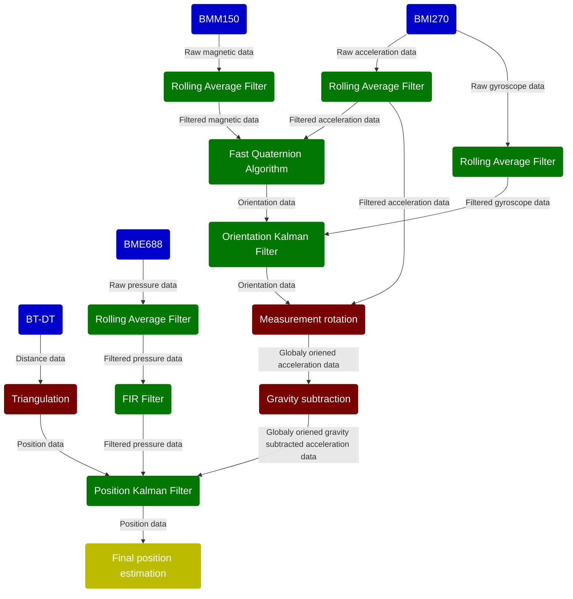
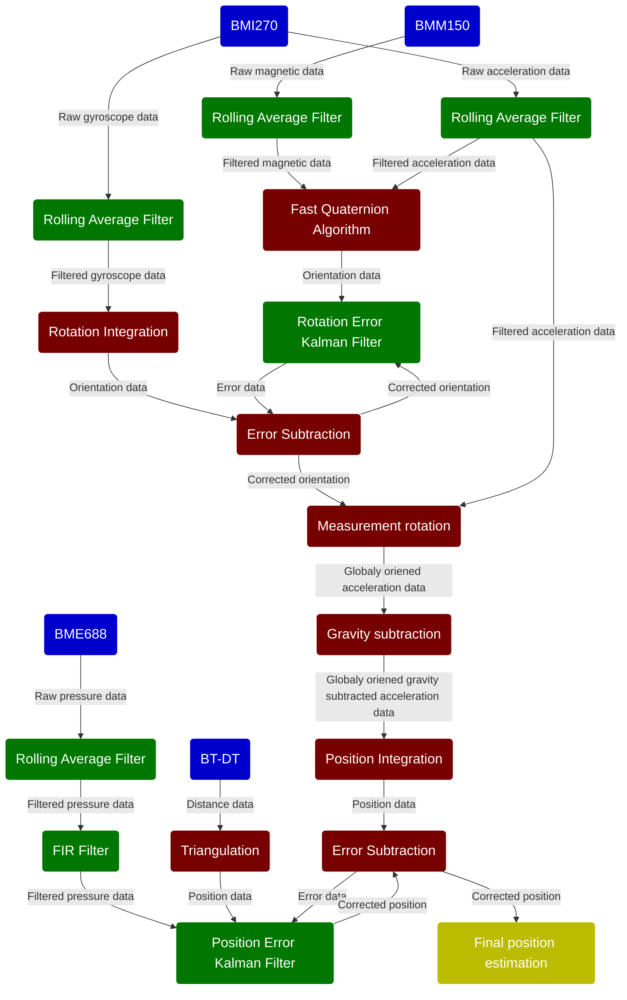

## Current dataflow

```mermaid
flowchart TD
    BMI270(BMI270)
    BME688(BME688)
    BMM150(BMM150)
    BT-DT(BT-DT)

    RAF1(Rolling Average Filter)
    RAF2(Rolling Average Filter)
    RAF3(Rolling Average Filter)
    RAF4(Rolling Average Filter)
    FQA(Fast Quaternion Algorithm)
    OKF(Orientation Kalman Filter)
    PKF(Position Kalman Filter)

    MR(Measurement rotation)
    GS(Gravity subtraction)

    FIR(FIR Filter)

    TRI(Triangulation)

    FINAL(Final position estimation)

    %%%%%%%%%%%%%%%%%%%%%%%%%%%%%%%%%%%%%%%%%%%%%%%%%%%%%%%%%%%%%%%%%%%%%%%%%%%%%%%%%%%%%%%%%%%%%%%%

    BMI270 -->|Raw acceleration data| RAF1
    BMI270 -->|Raw gyroscope data| RAF4
    BMM150 -->|Raw magnetic data| RAF2
    BME688 -->|Raw pressure data| RAF3

    RAF1 -->|Filtered acceleration data| FQA
    RAF2 -->|Filtered magnetic data| FQA
    FQA -->|Orientation data| OKF
    RAF4 -->|Filtered gyroscope data| OKF

    OKF -->|Orientation data| MR
    RAF1 -->|Filtered acceleration data| MR

    MR -->|Globaly oriened acceleration data| GS

    RAF3 -->|Filtered pressure data| FIR
    FIR -->|Filtered pressure data| PKF

    BT-DT -->|Distance data| TRI
    TRI -->|Position data| PKF

    GS -->|Globaly oriened gravity subtracted acceleration data| PKF
    PKF -->|Position data| FINAL

    %%%%%%%%%%%%%%%%%%%%%%%%%%%%%%%%%%%%%%%%%%%%%%%%%%%%%%%%%%%%%%%%%%%%%%%%%%%%%%%%%%%%%%%%%%%%%%%%

    classDef sensor fill:#0000CC,stroke:#333,stroke-width:0px,font-size:20px,color:#FFF;
    classDef filter fill:#007700,stroke:#333,stroke-width:0px,font-size:20px,color:#FFF;
    classDef calculation fill:#770000,stroke:#333,stroke-width:0px,font-size:20px,color:#FFF;
    classDef final fill:#BBBB00,stroke:#333,stroke-width:0px,font-size:20px,color:#FFF;

    %%%%%%%%%%%%%%%%%%%%%%%%%%%%%%%%%%%%%%%%%%%%%%%%%%%%%%%%%%%%%%%%%%%%%%%%%%%%%%%%%%%%%%%%%%%%%%%%

    class BMI270 sensor
    class BMM150 sensor
    class BME688 sensor
    class BT-DT sensor

    class RAF1 filter
    class RAF2 filter
    class RAF3 filter
    class RAF4 filter
    class FQA filter
    class OKF filter
    class PKF filter

    class MR calculation
    class GS calculation

    class FIR filter

    class TRI calculation

    class FINAL final
```

## Alternative dataflow

```mermaid
    flowchart TD
    BMI270(BMI270)
    BME688(BME688)
    BMM150(BMM150)
    BT-DT(BT-DT)

    RAF1(Rolling Average Filter)
    RAF2(Rolling Average Filter)
    RAF3(Rolling Average Filter)
    RAF4(Rolling Average Filter)

    OINT(Rotation Integration)
    OESUB(Error Subtraction)

    FQA(Fast Quaternion Algorithm)

    REKF(Rotation Error Kalman Filter)

    MR(Measurement rotation)
    GS(Gravity subtraction)

    PINT(Position Integration)
    PESUB(Error Subtraction)

    TRI(Triangulation)
    FIR(FIR Filter)

    PEKF(Position Error Kalman Filter)

    FINAL(Final position estimation)

    %%%%%%%%%%%%%%%%%%%%%%%%%%%%%%%%%%%%%%%%%%%%%%%%%%%%%%%%%%%%%%%%%%%%%%%%%%%%%%%%%%%%%%%%%%%%%%%%

    BMI270 -->|Raw acceleration data| RAF1
    BMI270 -->|Raw gyroscope data| RAF4
    BMM150 -->|Raw magnetic data| RAF2
    BME688 -->|Raw pressure data| RAF3

    RAF4 -->|Filtered gyroscope data| OINT

    RAF2 -->|Filtered magnetic data| FQA
    RAF1 -->|Filtered acceleration data| FQA

    OINT -->|Orientation data| OESUB
    FQA -->|Orientation data| REKF
    OESUB -->|Corrected orientation| REKF
    REKF -->|Error data| OESUB

    OESUB -->|Corrected orientation| MR
    RAF1 -->|Filtered acceleration data| MR

    MR -->|Globaly oriened acceleration data| GS

    GS -->|Globaly oriened gravity subtracted acceleration data| PINT

    PINT -->|Position data| PESUB

    BT-DT -->|Distance data| TRI

    RAF3 -->|Filtered pressure data| FIR

    FIR -->|Filtered pressure data| PEKF
    TRI -->|Position data| PEKF
    PESUB -->|Error data| PEKF
    PEKF -->|Corrected position| PESUB

    PESUB -->|Corrected position| FINAL

    %%%%%%%%%%%%%%%%%%%%%%%%%%%%%%%%%%%%%%%%%%%%%%%%%%%%%%%%%%%%%%%%%%%%%%%%%%%%%%%%%%%%%%%%%%%%%%%%

    classDef sensor fill:#0000CC,stroke:#333,stroke-width:0px,font-size:20px,color:#FFF;
    classDef filter fill:#007700,stroke:#333,stroke-width:0px,font-size:20px,color:#FFF;
    classDef calculation fill:#770000,stroke:#333,stroke-width:0px,font-size:20px,color:#FFF;
    classDef final fill:#BBBB00,stroke:#333,stroke-width:0px,font-size:20px,color:#FFF;

    %%%%%%%%%%%%%%%%%%%%%%%%%%%%%%%%%%%%%%%%%%%%%%%%%%%%%%%%%%%%%%%%%%%%%%%%%%%%%%%%%%%%%%%%%%%%%%%%

    class BMI270 sensor
    class BMM150 sensor
    class BME688 sensor
    class BT-DT sensor

    class RAF1 filter
    class RAF2 filter
    class RAF3 filter
    class RAF4 filter
    class REKF filter

    class INT calculation
    class FQA calculation
    class MR calculation
    class OINT calculation
    class OESUB calculation
    class GS calculation
    class PINT calculation
    class PESUB calculation
    class TRI calculation

    class FIR filter
    class PEKF filter
    
    class FINAL final
```